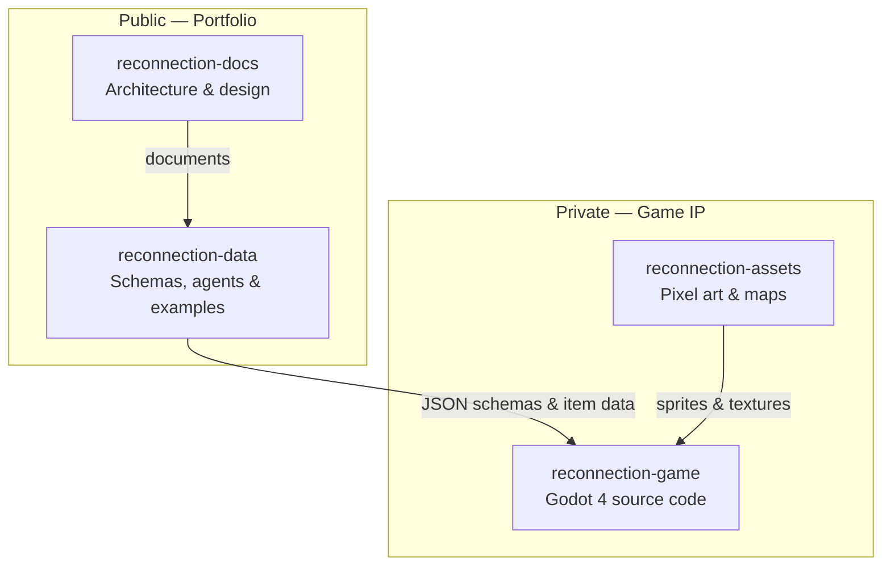

# Reconnection
> Top-down pixel art game set in a world where industry has stopped—and healing the planet is the only way forward.
**Status:** In Development · Godot 4.3 · C# · Data-Driven
---

## About

**Reconnection** is a top-down pixel art game set on a planet pushed to the edge. Pollution and waste have accumulated to a breaking point—governments worldwide have halted all manufacturing, shut down industry, and redirected every effort toward cleaning the Earth and relearning how to live on it without causing further harm. Progress now depends on restoration, not production.

You are deployed to a damaged biome with a tent, a patch of assigned land, and a simple mandate: help it heal. Daily life blends survival and stewardship—you grow crops, raise farm animals, and trade to sustain yourself in a world where nothing new is made. Waste is everywhere: sort it into the proper bins, or salvage materials to craft tools and goods from what already exists. Over time, as the land cleanses, the biome begins to recover.

Restoration is never only environmental. Through missions you navigate tensions among local residents, deal with thieves and hostile factions, and encounter the biome's magical beings—nature spirits, unsettled by the damage done to their home. Conflict arises only in self-defense, or when you must stand firm to pacify a spirit or calm a situation. There is no lethal violence. Success is measured by the natural and spiritual recovery of the ecosystem, and by the wellbeing of the people who live there. When a biome is fully restored, you are sent to the next.

The tone is nostalgic, warm, and conscious—a game about mending what was broken before humanity can
move forward differently.

## Repository Ecosystem

Reconnection is split across four repositories—two public, two private—following a strict separation
of concerns: documentation and data pipelines are open for review; game source and original art
remain private. Public repos never depend on private ones, so anyone can explore the architecture
and data layer without access to the full game.

| Repository | Visibility | Purpose |
|------------|------------|---------|
| [**reconnection-docs**](https://github.com/pabloarak/reconnection-docs) | Public | Architecture documentation, design diagrams, project overview |
| [**reconnection-data**](https://github.com/pabloarak/reconnection-data) | Public | JSON schemas, AI data agents, example datasets, validation scripts |
| **reconnection-game** | Private | Godot 4.3 / C# source code, gameplay logic, production data |
| **reconnection-assets** | Private | Original pixel art (Aseprite), exported sprites, tilemaps |

## Documentation

Architecture and design documents live in [`docs/`](docs/). Each file includes Mermaid diagrams where a visual flow helps.

| Document | Description |
|----------|-------------|
| [Technical Vision](docs/technical-vision.md) | Engine choice (Godot 4.3 / C#), core design patterns (Observer, State, Command), and the biocentric data model |
| [Biocentric Mechanics](docs/biocentric-mechanics.md) | Core gameplay loop in three phases: Cleansing → Restoration → Reconnection |
| [Inventory System](docs/inventory-system.md) | Waste collection, material categorization, processing flow, and decoupled player–world interaction |
| [Cloud Infrastructure](docs/cloud-infrastructure.md) | *Planned* — GCP integration for global restoration metrics and AI-driven mission generation |

## Design Principles

These principles guide every technical and design decision in the project—from repository structure to gameplay systems.

- **Strict decoupling** — Game logic, presentation, and data live in separate layers. Domain code has no dependency on the engine or UI.
- **Data-driven by default** — Waste items, toxicity levels, and material properties come from validated JSON schemas—not hardcoded values in source code.
- **Biocentric success metrics** — Player progress is measured by ecosystem and spiritual recovery, and by the wellbeing of local communities—not by wealth accumulation alone.
- **Non-violent conflict design** — Encounters are defensive or pacifying. There is no lethal combat; standing firm and de-escalating are core mechanics.
- **Open architecture, protected content** — Documentation and data pipelines are public for review; game source and original art remain private by design.

## Project Status

| Phase | Status |
|-------|--------|
| Architecture & documentation | ✅ Done |
| Multi-repo ecosystem | ✅ Done |
| Data pipeline (AI agent + example dataset) | 🔄 In progress |
| JSON schema & validation | ⏳ Planned |
| Initial pixel art assets | 🔄 In progress |
| Godot 4 vertical slice | ⏳ Planned |
| Playable demo (itch.io) | ⏳ Planned |

## Tech Stack

| Layer | Tools |
|-------|-------|
| Game engine | Godot 4.3, C# (.NET) |
| Data pipeline | Python, CrewAI, JSON Schema |
| Art | Aseprite / Resprite (pixel art) |
| Cloud *(planned)* | Google Cloud Run, Firestore, Vertex AI |

## Author

Personal passion project by **Pablo Arak**.

- Data pipeline & schemas → [reconnection-data](https://github.com/pabloarak/reconnection-data)
- Playable demo → *coming soon*

---

*Reconnection* — a game about healing the planet before humanity can move forward differently.