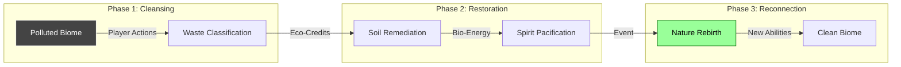

# 🌿 Biocentric Restoration Loop

The core mechanic focuses on transitioning the environment from a "Waste State" to a "Living State" through conscious player intervention.

```mermaid
graph LR
    subgraph "Phase 1: Cleansing"
        A[Polluted Biome] -->|Player Actions| B[Waste Classification]
    end

    subgraph "Phase 2: Restoration"
        B -->|Eco-Credits| C[Soil Remediation]
        C -->|Bio-Energy| D[Spirit Pacification]
    end

    subgraph "Phase 3: Reconnection"
        D -->|Event| E[Nature Rebirth]
        E -->|New Abilities| A2[Clean Biome]
    end

    style A fill:#444,stroke:#fff,color:#fff
    style E fill:#9f9,stroke:#060,color:#000
```