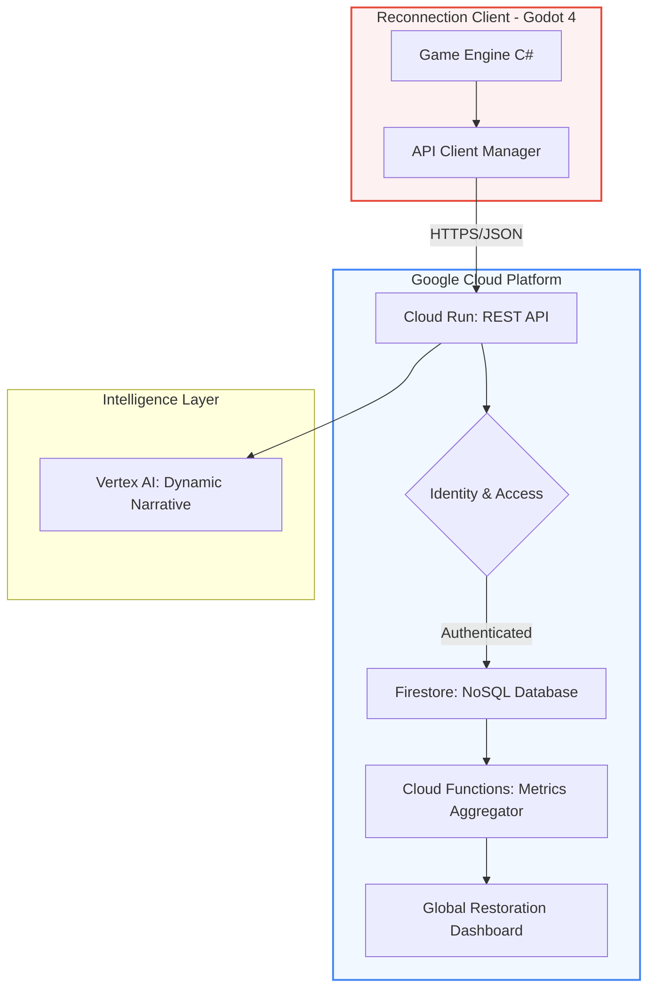

# ☁️ Global Restoration Telemetry & Cloud Architecture

This document describes the integration between the **Reconnection** client and **Google Cloud Platform** to manage global environmental recovery metrics and AI-driven mission generation.

